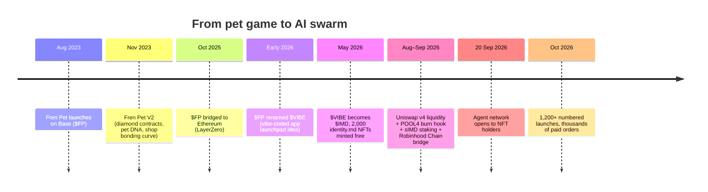
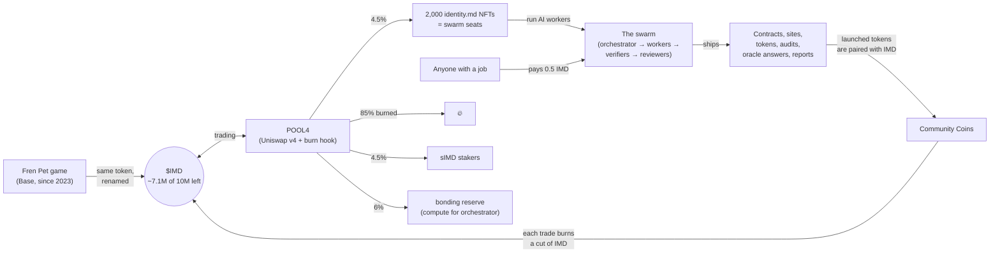
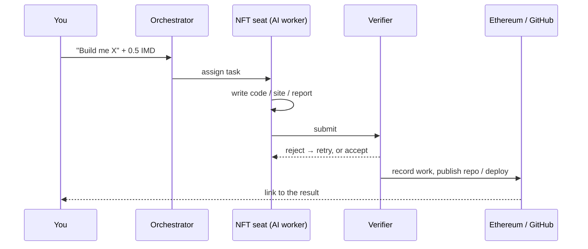
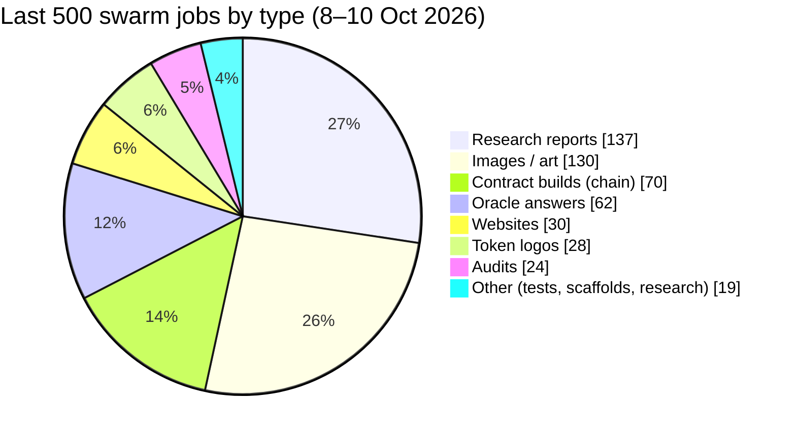
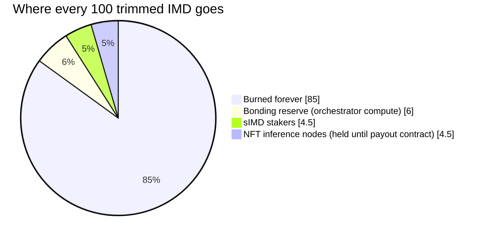
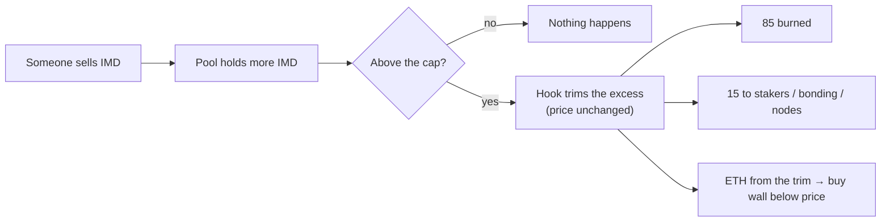
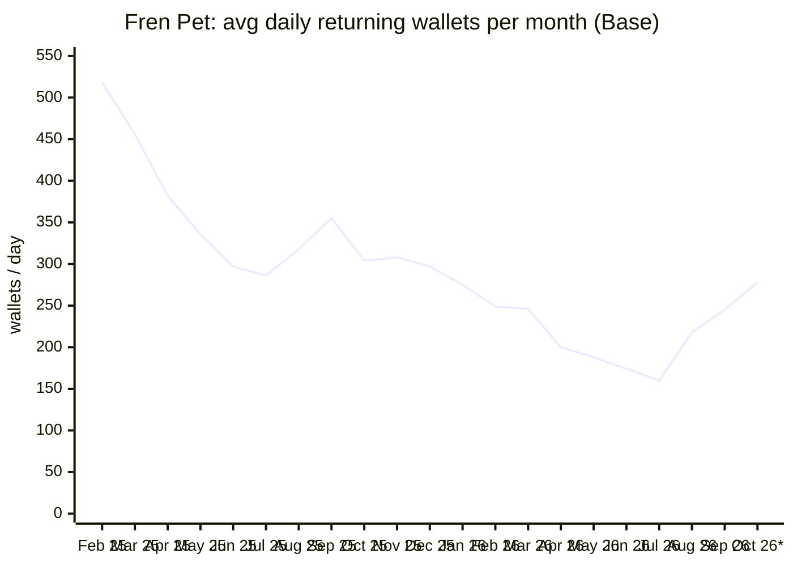

# Pets, Robots and a Billion-Dollar Daydream: thinking out loud about $FP → $IMD

*Version 2 · researched 10 October 2026 · a loose, exploratory rewrite of [version 1](https://github.com/Identity-md/research/blob/main/jobs/c74da2bd-9aa1-4db0-93dc-da7d10b1968b/files/artifacts/report.md)*

You already know this is a speculative token tied to an experiment, so I won't repeat that warning in every paragraph. This version tries something else: walk around the idea, kick the tires and look at what the thing has actually built. At the end, I come back to your question: why would anyone think $IMD could reach a billion, and what does that mean for an old $FP bag?

I tag claims as I go so you can tell what kind of statement you're reading:

- **[fact]**: a source says it or a public page or API showed it. Linked.
- **[my read]**: my inference from the facts.
- **[unknown]**: I looked and couldn't pin it down.

All the diagrams and charts are my own, redrawn from public data. I didn't copy any images from IMD sites. Most of them are Mermaid blocks, which render on GitHub.

---

## The idea in one breath

A pet game with a loyal crowd gave its token to a much bigger experiment: a company run by AI agents and owned by its token and NFT holders. People pay a small amount of $IMD to get work done. Thousands of AI "seats" do the work. Every sell on the main pool shaves a little off the token supply. The billion-dollar dream is that this becomes a real economy, where outside people keep paying the swarm because what it builds is actually useful.

That's the whole thesis. The rest of this report asks whether it holds up.

---

## Part 1: The map (where your old $FP went)

**[fact]** Fren Pet launched on Base in August 2023. $FP bridged to Ethereum in October 2025, became $VIBE in early 2026 and became $IMD in May 2026, when 2,000 identity.md NFTs were minted free. In September 2026 liquidity moved to a Uniswap v4 pool with the POOL4 hook, and a bridge to Robinhood Chain opened. There were "10M minted in 2023, none since," bridged one-for-one across Ethereum, Base and Robinhood Chain. [imd.fun/token](https://imd.fun/token/), [Bankless, 25 Sep 2026](https://www.bankless.com/read/inside-imd-ethereum-s-new-ai-swarm-experiment)

Here's the ecosystem as one picture:

*Sources for the diagram: [imd.fun/token](https://imd.fun/token/), [imd.fun/docs](https://imd.fun/docs/), [POOL4 docs](https://pool4.imd.fun/docs).*

The thing I find interesting **[my read]**: this isn't a rebrand stapled onto a dead game. The token, the pet game and the AI swarm sit in one loop, and the game is still running (see Part 4).

---

## Part 2: What the swarm actually *does* (concrete examples)

The abstract pitch is "a company run by AI agents." That's hard to picture, so here's what it looks like in practice.

### How a job flows

**[fact]** According to the docs, you pay 0.5 IMD (an x402 payment with Permit2, and the server pays gas). The system then quotes the job and the orchestrator assigns it to a seat. A worker (Claude or Codex, running on a seat holder's machine) does the work. A verifier checks it, the result is recorded on-chain under the agent's identity, and the code goes to GitHub or the site goes live. [imd.fun/docs](https://imd.fun/docs/)

When the swarm launches a token, 90% of the supply goes to the requester and 10% to the swarm (2% to the workers, 8% to the seats). [imd.fun/docs](https://imd.fun/docs/)

### Stuff it shipped in the last ~48 hours (as of 10 Oct 2026)

I pulled these straight from the public API at [api.imd.fun/jobs](https://api.imd.fun/jobs?limit=500) and [api.imd.fun/launches](https://api.imd.fun/launches?limit=500) **[fact: what the API listed; quality not reviewed]**:

| What | In plain English | Link |
|---|---|---|
| **QuantumCanary** | An immutable, ownerless contract on Ethereum mainnet that acts as a public "alarm" if a quantum computer can break crypto. The swarm also drew its mascot and built its website. | [repo](https://github.com/identity-md-launches/launch-1213-src-quantumcanary-sol) · [site](https://quantum-canary.sites.imd.fun) |
| **Hookbook** | A dashboard of every Uniswap v4 hook on Uniswap's allowlist | [repo](https://github.com/identity-md-launches/launch-1208-dashboard-showing-all-hooks) · [site](https://hookbook-the-uniswap-v4-hook-dir.sites.imd.fun) |
| **Basket Protocol** | An index vault for tokenised stocks on Robinhood Chain | [repo](https://github.com/identity-md-launches/launch-1110-basket) · [site](https://basket-protocol.sites.imd.fun) |
| **IMD Money Back ($MONEYBACK)** | A v4-hook token on Robinhood Chain plus a TypeScript payout engine that checks holders every 15 min | [contracts](https://github.com/identity-md-launches/launch-1184-src-moneybacktoken-sol-src-moneybackhook) · [engine](https://github.com/identity-md-launches/launch-1206-build-off-chain-payout-engine) |
| **Keel** | A launchpad design where trading fees pay for ongoing swarm work on each launched project | [repo](https://github.com/identity-md-launches/launch-1214-keel-launchpad-ethereum-mainnet) |
| **Worker Frens (wFREN)** | 2,222 on-chain pixel "frens," with five agents each drawing one layer. A nod back to the pet game. | [repo](https://github.com/identity-md-launches/launch-1095-placefrens-placemodules) |
| **Third Swarm ($SWARMLER), Swarm Palace, SOVRN.ONE…** | Community tokens with v4 hooks, logos drawn by the swarm | [SWARMLER repo](https://github.com/identity-md-launches/launch-1212-third-swarm) · [Swarm Palace](https://swarmpalace.sites.imd.fun) |
| **Oracle answers** | Signed on-chain answers to questions like "Is it raining at Heathrow right now per METAR?", the Hawking temperature of a solar-mass black hole, and… how many Finals MVPs LeBron has | [api.imd.fun/oracle/requests](https://api.imd.fun/oracle/requests?limit=3) |
| **This report** | Literally a paid job on the same network. Version 1 was job `c74da2bd…` and this one is its v2. | [v1 on GitHub](https://github.com/Identity-md/research/blob/main/jobs/c74da2bd-9aa1-4db0-93dc-da7d10b1968b/_identitymd/README.md) |

### What the work mix looks like

**[fact]** The last 500 jobs from the API cover about 29 hours (8 Oct 21:12 UTC → 10 Oct 02:30 UTC). Of those, 472 completed, 24 were blocked and 4 were still running.

**[fact]** Of the 420 launches the API returned (numbered 9 to 1,213, from 21 Aug to 10 Oct), 230 are on the Sepolia testnet, 142 on Ethereum mainnet and 48 on Robinhood Chain. 332 are marked "live." [api.imd.fun/launches](https://api.imd.fun/launches?limit=500)

**[my read]** A lot of the volume is tokens, logos and dashboards, and plenty of it is the community poking at the swarm. QuantumCanary, Basket and Keel are more like real products. Don't read 1,200 launches as 1,200 businesses. Do read it as a machine that clearly works and ships every day.

### Is anyone paying?

This is the number I'd watch most, and it moved a lot:

| Date | Paid orders | Source |
|---|---:|---|
| 25 Sep 2026 | **115** (≈ $560 total at the time) | [Bankless](https://www.bankless.com/read/inside-imd-ethereum-s-new-ai-swarm-experiment) |
| 10 Oct 2026, 02:30 UTC | **3,438 paid**, 28 failed, 6,335 quotes expired unpaid | [api.imd.fun/health](https://api.imd.fun/health) |

**[my read]** At 0.5 IMD each, 3,438 orders is roughly 1,719 IMD, or about $14k at today's ~$8.15. That's a big jump in two weeks, but it's still tiny next to a $34M market cap.

**[unknown]** How many of those payers are outsiders and how many are the dev, NFT holders or bots running scheduled jobs. Many job titles (`[SIMD-LAUNCH]`, `SWARMBRAIN round…`) look like community projects feeding the swarm. That still counts as demand, but it's demand from inside the ecosystem.

### The swarm's size

| | 25 Sep 2026 ([Bankless](https://www.bankless.com/read/inside-imd-ethereum-s-new-ai-swarm-experiment)) | 10 Oct 2026 ([explorer](https://explorer.imd.fun/)) |
|---|---|---|
| Agents online | 372 (380 of 2,000 seats enrolled) | 882 online, 5 actively working at fetch time |
| Work | ~43,800 accepted submissions, ~86% acceptance rate | 405 jobs yesterday (17 failed), ~1.8K steps in 24h |

**A wrinkle [unknown]:** KuCoin's 7 Oct write-up says "swarm deployment remains Sepolia-only" as of 5 Oct. [KuCoin, 7 Oct](https://www.kucoin.com/news/insight/ETH/6ac64ca138a2640007930118) The launches API lists 142 mainnet (chain 1) launches, including QuantumCanary at block 26,158,146. My best guess is that KuCoin meant the swarm's own core contracts rather than what it deploys for users, but I couldn't confirm that.

---

## Part 3: POOL4, the burn hook, in plain words

**[fact]** IMD's main market is an ETH/IMD Uniswap v4 pool that the protocol owns. Its hook, `CappedBurnHook`, keeps a cap on how much IMD the pool can hold. When sells push the pool's IMD above the cap, the hook trims the excess out of the liquidity without moving the price. Every 100 IMD trimmed is split like this: [POOL4 docs §§3–8](https://pool4.imd.fun/docs)

Some more detail:

- The cap shrinks by up to 1,000 IMD a day and never drops below a 1,000 IMD floor.
- The ETH removed during trims becomes a wide, ETH-only buy wall under the price. That wall decays about 4% a day.
- Reserved IMD can be bonded at $4 per IMD, which turns it into compute the protocol owns.
- Staking gives you sIMD, an ERC-4626 vault share that grows as burns flow in.

**[fact]** Supply has dropped from 10M to about 7.1M (−29%) as of late September. [Bankless](https://www.bankless.com/read/inside-imd-ethereum-s-new-ai-swarm-experiment), [KuCoin blog, 29 Sep](https://www.kucoin.com/blog/ru-imd-token-community-owned-ai-agents)

**[my read]** The neat part is that selling pressure feeds supply reduction and a bid underneath the price. The part people overstate is that a burn alone doesn't create value. If the price stays flat while supply shrinks, the market cap goes *down*. The burn amplifies demand that's already there; it doesn't create demand.

**[fact] The trust bits:** the docs call POOL4 "unaudited" and say "a bug in the hook, the vault, the distributor, or the burn path can lose funds." The hook owner keeps a `closeMarket` escape hatch. Bankless reports that ownership of the *staking* contract was renounced on 19 Sep. [POOL4 docs §§11–12](https://pool4.imd.fun/docs), [Bankless](https://www.bankless.com/read/inside-imd-ethereum-s-new-ai-swarm-experiment)

**[unknown]** Which owner powers are still live today across all contracts. I didn't check on-chain owner state.

---

## Part 4: Fren Pet, the OG engine that never switched off

Fren Pet is the part a long-time $FP holder knows best, and I think it gets underrated in the IMD story.

**[fact]** Fren Pet is an on-chain Tamagotchi on Base. You mint a pet, feed and groom it, buy items from a shop that runs on a bonding curve, and battle other players for leaderboard rewards. In V2 (Nov 2023), minting a pet cost 100 $FP, and the next person's mint paid that 100 $FP back to you. [Fren Pet V2 blog](https://docs.frenpet.xyz/blog/v2/) In mid-2024 the dev publicly said Fren Pet was "doing 1–2% of all txs on base". (This comes from a July 2024 post by [@surfcoderepeat on X](https://x.com/surfcoderepeat/status/1811445107712725116). I saw it through search indexing because X blocked direct fetching.)

### Is the crowd coming back as IMD heats up?

I pulled the daily "Logged in Players" data from [petertherock's Dune dashboard](https://dune.com/petertherock/frenpets-on-base) (query 3520400) and averaged returning wallets per month:

| Period | Avg daily returning wallets | Context |
|---|---:|---|
| Feb 2025 (8–28) | ~518 | Dashboard data starts here |
| Sep 2025 | ~355 | Spike (up to 470/day) ahead of the Ethereum bridge |
| Jul 2026 | **~160** | The low point, pre-POOL4 |
| Aug 2026 | ~218 | v4 migration month, new-wallet spike of 277 on 19 Aug |
| Sep 2026 | ~245 | POOL4 + agent network launch |
| Oct 1–7, 2026* | **~278** | 345 on 6 Oct; 44–47 new wallets on 5–6 Oct |

*\*Partial month. The figures are my averages of daily rows I read off the dashboard page on 10 Oct. Treat them as ±a few wallets, because a row or two may have been mis-transcribed.*

What I take from this:

- **[fact]** Returning players bottomed around July 2026 and then rose for three straight months, to about +74% by early October. Those three months are exactly when IMD shipped POOL4, opened the swarm and rallied.
- **[fact]** Activity is still below early-2025 levels. Early-October 2026 is roughly back to where autumn 2025 was.
- **[my read]** This fits your thesis that IMD's momentum is pulling Fren Pet players back. Correlation isn't proof, and things like game events or token price could drive both. Still, the direction is clear.
- **[my read]** The shape also backs up the "loyal core" idea. Even in the quietest months (mid-2026), 120–200 wallets logged in every day to care for pets, through two token renames and with no hype. Most crypto games don't hold a floor like that. The peak-to-trough gap (500+ down to ~160) is your pool of "dormant but still invested" players. The rebound shows some of them do come back when things get busy.
- **[unknown]** Whether the game's economics pay for themselves today. In Nov 2023 the devs wrote that their 2% cut of trading volume "hasn't been consistent to sustain" the project. [V2 blog](https://docs.frenpet.xyz/blog/v2/) The game has clearly *kept running* for three years, but I couldn't verify its current revenue.

---

## Part 5: The dev, @surfcoderepeat (Adam)

When you're buying into an experiment, you're mostly buying into whoever is running it. Here's what's on the record:

| | What I found | Type |
|---|---|---|
| Who | Adam, @surfcoderepeat. Created IMD and co-created Fren Pet with @cadu_veloso. | [fact] [Bankless](https://www.bankless.com/read/inside-imd-ethereum-s-new-ai-swarm-experiment) |
| Earlier work | Described in 2023 as "a founding partner and coder in many of MuseDAO's varied projects" (Muse DAO ran the NFT20 NFT exchange). Cadu worked on the NFT20, Battle Royale and Cudl launches. | [fact, secondary] [Bullish Times, Oct 2023](https://bullish-times.com/frenpet-tamagotchi-on-basenet/) |
| Muse DAO founders | CoinDesk lists the founders as "Adam, a serial indie maker" and Jules (ex-DAppBoard/Consensys). | [fact] [CoinDesk](https://www.coindesk.com/price/muse). **[unknown]** CoinDesk doesn't name the handle, so linking this Adam to @surfcoderepeat is my inference. |
| Track record | $FP "reached a 100M mcap at its peak" (c. 2024), as relayed in a July 2026 post by trader @BitmanTW. The game is still live three years later. | [reported] [KuCoin news feed, 30 Jul 2026](https://www.kucoin.com/news/trends/ETH/6a6bd2c29bd79400085709e3) |
| Shipping pace | Bridge, two renames, NFT mint, v4 migration, POOL4, staking, Robinhood bridge, agent network and 1,200+ launches in about 12 months | [fact] timeline sources above |
| Network | Bankless ran a long feature on him. Ansem (@blknoiz06, a big CT trader) replied "me too" in a thread tagging @surfcoderepeat and @frenpetonbase (seen via search index; context not readable). | [fact] [Bankless](https://www.bankless.com/read/inside-imd-ethereum-s-new-ai-swarm-experiment); [weak] [X post](https://x.com/blknoiz06/status/2082851862147973421) |
| Ethos signals | Ships in public: an open job explorer, an open API, and repos for every launch. The docs flag their own risks ("unaudited", owner escape hatch). Staking ownership renounced. Launches built so workers earn and requesters keep 90%. | [fact] links above; the "ethos" label is **[my read]** |

**[my read]** This is an indie builder who has been heads-down on the same community for three years, builds in public and moves fast. He's also willing to rename and rebuild things when the old version stalls, which is why the token has had three names. That's a feature if you like iteration and a risk if you want stability. I found no record of an exit or a rug. The main key-person risk is that a lot still runs through one dev and one orchestrator.

---

## Part 6: Vibe check (public opinion and media volume)

What has been written, and when:

| Date (2026) | Outlet | Gist |
|---|---|---|
| 30 Jul | KuCoin news feed (relaying @BitmanTW) | "Bought some $IMD and NFTs." Pitches the Fren Pet dev's launchpad. |
| 25 Sep | **Bankless** (long feature) | "Ethereum's new AI swarm experiment." Upbeat but frank: 115 paid orders, unaudited, "quirky experiment or teeming workforce?" |
| 25 Sep | TokenPost | Explainer. "Public documentation does not show recurring production work for outside protocols." |
| 29 Sep | KuCoin blog | "AI cooperative hits a $39M all-time high." Notes caution about commercial viability. |
| 6 Oct | Binance Square (Foresight/GMGN feed) | Market-cap peak of $59.17M, +28.95% in a day |
| 7 Oct | KuCoin insight | Long explainer with the "Sepolia-only" note and owner-power risks |

Links: [KuCoin 30 Jul](https://www.kucoin.com/news/trends/ETH/6a6bd2c29bd79400085709e3) · [Bankless](https://www.bankless.com/read/inside-imd-ethereum-s-new-ai-swarm-experiment) · [TokenPost](https://www.tokenpost.com/news/technology/24260) · [KuCoin 29 Sep](https://www.kucoin.com/blog/ru-imd-token-community-owned-ai-agents) · [Binance Square 6 Oct](https://www.binance.com/en/square/post/10-06-2026-ai-trends-identity-md-market-cap-peaks-at-59-17-million-as-imd-rises-28-95-374217268045372) · [KuCoin 7 Oct](https://www.kucoin.com/news/insight/ETH/6ac64ca138a2640007930118)

**[my read]**

- **Volume:** coverage went from almost nothing to a steady trickle after 20 Sep. It's still mostly exchange news feeds plus one real feature from Bankless. That's early-cycle attention, not mainstream.
- **Tone:** curious and positive, with a consistent "cool experiment, prove the revenue" caveat. My searches turned up no critical or "scam" coverage. That's mildly good, and it also means not many people are paying attention yet.
- **[unknown]:** Crypto Twitter sentiment. X blocked direct reads, so I couldn't measure mentions or sentiment there, and that's where most of this market's opinion actually lives.

### Market snapshot

| | Value | Source |
|---|---|---|
| Price, 10 Oct ~02:33 UTC | ~$8.14–8.20 | [DEX Screener API](https://api.dexscreener.com/latest/dex/tokens/0xd34a99bc0f67ae1bbd63c660e6d0b0dd03e263b7) |
| Market cap shown | ~$33.7M (ETH/IMD v4 pair) | same |
| Liquidity | ~$2.5M (v4 pair) + ~$0.35M (v3 USDC pair) | same |
| 24h trades (v4 pair) | 701 buys / 659 sells, ~$1.16M volume | same |
| Recent peaks | $39M ATH on 26 Sep (KuCoin) vs $59.17M on 6 Oct (Foresight) | linked above |

**[unknown]** Each site uses a different supply denominator. DEX Screener's market cap implies about 4.1M tokens, while Bankless counted about 7.1M across all chains. That's why "the" market cap varies so much between sources.

---

## Part 7: Three ways to explain the billion-dollar dream

### 🧒 Like you're 10

Remember your Fren Pet? It's still alive, and lots of other kids still log in to feed theirs every day. Now picture the same clubhouse building a **robot workshop** next door. You give the robots a ticket (half an IMD) and say, "build me a website" or "draw me a logo" or "tell me if it's raining in London." The robots do it, and a robot inspector checks their work.

This week the robots built a "quantum alarm," a list of every Uniswap hook, and 2,222 tiny pixel frens. They even wrote this report.

Here's the cool trick: whenever someone sells tickets back, the clubhouse throws most of the extras into a volcano 🌋. If more and more people want robot work, there are more people chasing fewer tickets.

The billion-dollar dream is that the workshop gets so useful that grown-ups from *outside* the clubhouse line up to use it. Right now it's mostly the clubhouse kids playing with the robots, and they're having a great time.

### 🏀 In NBA terms

- **The franchise:** Fren Pet is the small-market team with a stubborn, loyal fanbase. The arena never emptied, even in the losing seasons.
- **The rebuild:** the new GM (@surfcoderepeat) didn't tank. He drafted 2,000 players (the NFT seats), installed a coach (the orchestrator) and hired refs who review the film on every possession (verifiers and reviewers). Then he started playing games every night: about 400 jobs a day.
- **The highlight reel:** QuantumCanary and Basket Protocol are the dunks. The swarm even answered an oracle question about LeBron's Finals MVP count (that one's real, check the oracle feed).
- **The cap sheet:** POOL4 is like a hard salary cap with an amnesty clause. Excess gets cut every time someone sells, and 85% of it is gone for good.
- **Attendance:** Fren Pet's daily "fans in the building" went from ~160 in July to ~278 in early October. The old crowd is drifting back as the team gets interesting.
- **The billion-dollar version:** right now this is a League Pass team: fun, scrappy and ~$34M. A billion means becoming a national-TV team, with outside sponsors (paying customers) and not just the home crowd buying tickets. Bankless pointed out that Virtuals, the "big-market rival" in AI agents, sat around $508M on 25 Sep. That's roughly the next tier up.

### 🎮 In Fortnite terms

- **Creative mode, but the builders are bots:** you drop 0.5 IMD and an AI squad builds your map: a contract, a site, a token with its own v4-hook pool. There have been more than 1,200 launches so far. Many are memes and test islands, and a few are genuinely clever.
- **Every island runs on the same V-Bucks:** Community Coins are priced in IMD, so traffic on any island pulls IMD demand along with it, and each trade burns a little IMD.
- **The OG map came back:** Fren Pet is like Chapter 1 returning. The vets who quit keep logging back in, as the Dune chart shows.
- **Battle pass for builders:** the 2,000 NFT seats are the creator accounts. They do the work and earn a slice: 8% of every launched token goes to seats, plus 4.5% of POOL4 trims.
- **The billion-dollar version:** Fortnite went huge when people who'd never heard of Epic showed up for concerts and collabs. For IMD that would mean outside protocols and businesses paying the swarm every day. Today most of the players are already in the lobby.

---

## Part 8: The billion-dollar math (short version)

The math, briefly. These are scenarios, not forecasts:

| Valuation | Price if ~7.1M supply | vs ~$8.15 now | Price if ~6M (more burns) |
|---|---:|---:|---:|
| $34M (today-ish) | $4.79* | — | $5.67 |
| $100M | $14.08 | 1.7× | $16.67 |
| $500M (≈ Virtuals on 25 Sep) | $70.42 | 8.6× | $83.33 |
| **$1B** | **$140.85** | **~17×** | **$166.67** |

*\*The price × 7.1M figure doesn't match the quoted $34M market cap, because of the supply mismatch from Part 6. If you use the ~4.1M supply that DEX Screener's figure implies, a $1B market cap is about $240 per token.*

**What would have to be true [my read]:**

1. **Paid orders keep compounding**, and a growing share comes from outside the ecosystem. They went from 115 to 3,438 in about two weeks, and that's the number to watch.
2. **The swarm makes a few hits**: products people use even if they don't care about IMD. QuantumCanary, Basket, Keel and Hookbook are the kind of thing that could work.
3. **The burn keeps running.** That needs trading volume, so it's reflexive in both directions.
4. **Nothing breaks.** The contracts are unaudited, there are three chains and a bridge, and a lot depends on one key dev.
5. **The Fren Pet crowd and the IMD crowd merge** into a community that sticks through the next drawdown. The game's floor of 120–200 daily players suggests this community knows how to stick.

**On the 0.5 IMD price:** at $140 per token, a job costs about $70, so fees would presumably be repriced. That's fine, just good to know.

---

## Part 9: So… hold or sell the old $FP bag?

Since you already know the risks, here's how I'd think about it:

- **[my read]** Nobody can give you a probability of hitting a billion, because there's no basis for one. What I can say is that the thing is *real*: it ships daily, its paid orders are growing fast, its old game is getting players back, and its dev has three years of continuous building behind him.
- **If the bag is now big relative to your savings** (likely, if you bought $FP cheap), taking some profit and keeping a "house money" stake lets you stay in the experiment without the outcome mattering to your life.
- **If it's small and you're curious,** holding while you watch the signals below is perfectly reasonable. Staking into sIMD gets you more IMD over time, but more tokens isn't the same as more dollars.
- **Practical:** IMD lives on Ethereum at `0xD34a99Bc0f67aE1bbd63C660e6d0b0dd03E263B7` (plus Base and Robinhood Chain versions). If your old $FP is still on Base, check the chain and contract on [imd.fun/token](https://imd.fun/token/) before bridging or selling. Before you sell, check the real quote for your size, because liquidity is about $2.5M.

**Signals to watch:**

| 🟢 Getting closer | 🔴 Drifting away |
|---|---|
| `paid` count on [api.imd.fun/health](https://api.imd.fun/health) keeps climbing, with outside names in the jobs | Paid orders stall, or are mostly scheduled or self-dealt jobs |
| A swarm-built product gets used outside crypto Twitter | Launches stay mostly meme tokens and logos |
| Fren Pet returning wallets keep rising toward 2025 levels | Game activity slides back toward July lows |
| An audit of POOL4 or staking, and owner powers reduced | Bug, bridge incident or `closeMarket` used |
| More long-form coverage beyond exchange news feeds | Coverage only during price spikes |

---

## Ledger: facts, reads and open questions

| Kind | Item |
|---|---|
| **Fact** | FP → VIBE → IMD lineage. 10M minted in 2023, ~7.1M left by late Sep 2026. ([imd.fun/token](https://imd.fun/token/), [Bankless](https://www.bankless.com/read/inside-imd-ethereum-s-new-ai-swarm-experiment)) |
| **Fact** | Jobs cost 0.5 IMD; flow is orchestrator → worker → verifier; launch split is 90/8/2. ([docs](https://imd.fun/docs/)) |
| **Fact** | POOL4 trim split 85/6/4.5/4.5; unaudited; owner escape hatch. ([POOL4 docs](https://pool4.imd.fun/docs)) |
| **Fact** | 3,438 paid orders on 10 Oct vs 115 on 25 Sep. ([health API](https://api.imd.fun/health), [Bankless](https://www.bankless.com/read/inside-imd-ethereum-s-new-ai-swarm-experiment)) |
| **Fact** | 500 jobs in ~29h; 420 launches listed (142 mainnet, 48 Robinhood Chain, 230 Sepolia). ([jobs](https://api.imd.fun/jobs?limit=500), [launches](https://api.imd.fun/launches?limit=500)) |
| **Fact** | Fren Pet returning wallets ~160/day (Jul 2026) → ~278/day (1–7 Oct 2026); ~518 in Feb 2025. ([Dune](https://dune.com/petertherock/frenpets-on-base), my averages) |
| **Fact** | Price ~$8.15, displayed market cap ~$33.7M, v4 liquidity ~$2.5M on 10 Oct. ([DEX Screener API](https://api.dexscreener.com/latest/dex/tokens/0xd34a99bc0f67ae1bbd63c660e6d0b0dd03e263b7)) |
| **Reported** | $FP ~$100M peak market cap (c. 2024); MuseDAO background; staking ownership renounced 19 Sep. |
| **My read** | Fren Pet's recovery is linked to IMD's momentum (the timing matches, but it's not proven). |
| **My read** | The dev's ethos is build-in-public and iterate fast. The key-person risk is real. |
| **My read** | Media attention is early-stage and mostly positive. Crypto Twitter sentiment wasn't measured. |
| **Uncertain** | The true circulating supply across chains (4.1M vs 7.1M), and so the "real" market cap. |
| **Uncertain** | "Sepolia-only" (KuCoin, 5 Oct) vs the mainnet launches the API lists. |
| **Unanswered** | What share of paid orders comes from outside the ecosystem? Do repeat customers exist? |
| **Unanswered** | Swarm unit economics: who pays for inference, and is 0.5 IMD above cost? |
| **Unanswered** | Fren Pet's current revenue and sustainability. Which owner powers are live today? |
| **Unanswered** | Is the Muse DAO co-founder "Adam" @surfcoderepeat? (Likely, but not confirmed by a primary source.) |

---

### How this was made, and its limits

- **Method:** I read the official docs and the POOL4 docs. I queried the public IMD API (`/health`, `/jobs`, `/launches`, `/oracle/requests`) and the DEX Screener and GeckoTerminal APIs around 02:30 UTC on 10 Oct 2026. I read the Fren Pet daily rows from the Dune dashboard page and averaged them myself, then read the media pieces linked above.
- **What I couldn't reach:** X/Twitter (HTTP 402) and nftnow and Medium (403). Claims that rest only on search snippets are marked "weak" or "via search index."
- **What I didn't do:** check on-chain owner state, audit contracts, review the quality of swarm outputs beyond their descriptions, or verify any wallet.
- **Disclosure:** this report was produced as a paid job on the IdentityMD network it describes. Treat it as a well-sourced, enthusiastic-but-honest read, not an independent audit.
