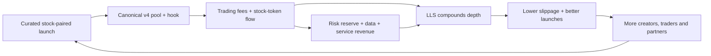

# LONG Ecosystem: Turn Stock-Paired Launches into a Liquidity Operating System

<div align="center">

<br><br>

## STRATEGIC THESIS & 90-DAY ACTION PLAN

### Public-source research report · 27 September 2026

<br>

`LONG.XYZ`  ·  `ROBINHOOD CHAIN`  ·  `UNISWAP v4`

<br><br>

**Prepared for:** IdentityMD contributor network  
**Scope:** LONG ecosystem, competitive context versus PONS, liquidity-moat strategy

</div>

> **Design note.** This report uses a restrained LONG-like palette for rendering: ink `#0B1020`, electric blue `#4BA3FF`, mint `#8BE7C5`, and warm gold `#E6B85C`. It is intentionally text-first so the evidence remains portable and auditable.

**Page 1 · Cover**

---

## Executive decision

### LONG should own the “stock-paired market formation” layer—not compete with PONS on generic launch volume.

The evidence supports a differentiated position: LONG’s stock-token quote asset creates a novel demand loop, while Uniswap v4 hooks and ecosystem partners can turn that loop into persistent, compounding liquidity. The near-term strategic risk is that LONG remains a high-beta launch surface whose liquidity is concentrated in a few pairs and whose success depends on scarce tokenized-stock float.

**Recommendation:** build a three-layer operating system over the next 90 days:

1. **Moat layer — canonical liquidity.** Make each successful LONG market an auditable, managed liquidity position with fee compounding, stock-float monitoring, circuit breakers, and transparent treasury policies.
2. **Arms layer — partner services.** Formalize Hookr, Shroom, Bundlecat and Orbio as independent but composable service arms: hook design, LP fee engine, AI-swarm launch operations, and agentic finance/inference capital.
3. **Distribution layer — repeatable market quality.** Optimize for retained liquidity, repeat traders, stock-pair breadth and fee-quality—not raw launch count or headline volume.

### The investment case in one sentence

LONG has a credible path to an onchain “BlackRock-like” liquidity black hole if it becomes the default allocator and manager of liquidity around tokenized-stock markets; it does **not** get there by simply launching more memes.

### Decision dashboard

| Question | Current read | Confidence | Management implication |
|---|---|---:|---|
| Is LONG differentiated? | Yes: launches pair against tokenized stocks; LONG’s flagship AI/NVDA pair reached reported peak market cap of $135m and ~$3.3m NVDA-pool liquidity. | Medium | Preserve stock-pair identity; deepen market quality. |
| Is the ecosystem growing? | Yes at the chain/category level: Robinhood Chain reported $989m single-day DEX volume and $708m TVL at the end of August; launchpad volume exceeded $600m on 1 September, with LONG reported near 25%. | Medium | Convert cyclical volume into durable liquidity and fee streams. |
| Is LONG already a liquidity black hole? | Not proven. Liquidity is concentrated and tokenized-stock float is finite; price dislocations are a material risk. | High | Track float capture, depth, slippage, and stress losses as first-class KPIs. |
| What beats PONS? | LONG owns a differentiated quote-asset loop; PONS has stronger generic launchpad scale and a broader ecosystem narrative. | Medium | Compete on specialized market infrastructure, partner quality and composability. |

**Source note:** Reported market figures are from The Block and CoinDesk Research; LONG’s own public app states “launch with stock tokens on Robinhood Chain.” See Sources A–C.

**Page 2 · Executive decision**

---

## 1. Current ecosystem overview: what is actually happening

### 1.1 The market has moved from meme beta toward infrastructure beta

Public reporting describes Robinhood Chain’s August shift from CASHCAT-led meme speculation toward utility and infrastructure tokens. The chain reached a reported **$989m single-day DEX volume**, **$708m TVL**, and approximately **$770m stablecoin supply** at the end of August; CoinDesk later reported approximately **$757m TVL** and **$868m stablecoin supply** on a different snapshot. These numbers are not directly interchangeable, but directionally show rapid liquidity formation.

The important change is composition: launchpads remain the volume engine, but liquidity infrastructure, emissions, lending, analytics and tokenized-equity primitives are becoming the investable narrative.

### 1.2 LONG’s product wedge is the quote asset

LONG’s public app positions itself as a token launchpad on Robinhood Chain. Independent reporting describes the core mechanism as pairing community tokens with tokenized equities such as NVDA, rather than with ETH or a stablecoin. That makes the market’s unit of account a stock-token ratio and creates a distinctive loop:

```text
Trader buys community token
        ↓
Stock token is acquired / retained in the pool
        ↓
Stock-pair liquidity and price discovery deepen
        ↓
More launches can use the same stock quote asset
        ↓
More volume, fees and ecosystem attention
```

This is a **mechanism-level fact**. The claim that it becomes a self-reinforcing “black hole” is an **inference** that requires sustained net liquidity retention and diversified pair demand.

### 1.3 The flagship case is AI/NVDA, but concentration is a feature and a risk

The Block reported that AI grew from roughly **$1.5m market cap on 1 August to a $135m peak on 30 August**, with more than **$3.3m liquidity in its NVDA pool**, over three times its WETH pool. CoinDesk reported that individual stock-meme markets could capture a meaningful share of onchain float, while noting that the absolute scale remains tiny relative to the underlying public company.

**Interpretation:** LONG demonstrated product-market resonance, not yet a diversified protocol moat. One flagship pair can validate the wedge while also masking fragility.

### 1.4 Ecosystem adjacency is already visible

- **SHROOM** describes itself as a liquidity network for stock tokens, aiming to pair with major stocks, route between them, compound fees, and use protocol-owned-liquidity fees for buyback-and-burn. Its site reports 10,000+ holders and nearly 600 MU distributed; these are issuer-reported figures, not independently audited.
- **Hookr** exposes modular Uniswap v4 hooks, LP management, launch flows and agent-readable integration surfaces on Robinhood Chain. It is a natural hook-design and execution partner, subject to security review.
- **Orbio** turns inference usage into an onchain CREDIT asset: stake ORBIO, earn CREDIT, trade it, transfer it or activate it for AI usage. It explicitly proposes that LP fees can fund a project’s agents.
- **Bundlecat** is included in the user brief as an AI-swarm-managed launch concept. I did not locate a sufficiently attributable public primary source for it; treat its current status and economics as unverified.

**Page 3 · Market and product overview**

---

## 2. Last-30-day read: trend and strategic shift

### What changed in the period ending 27 September 2026

The public evidence is strongest for a **market-level** shift, not a fully verified LONG roadmap shift:

| Trend | Evidence | Read-through |
|---|---|---|
| Utility/infrastructure gaining attention | The Block says August attention shifted from meme beta toward utility and infrastructure. | LONG should package liquidity infrastructure, not only launches. |
| Launchpads remain dominant flow routers | CoinDesk reports daily launchpad volume above $600m on 1 September; PONS ~60%, LONG ~25%. | Distribution is valuable, but share can move quickly. |
| Stock-meme liquidity is meaningful within the category | The Block reports stock-paired memes at roughly one-quarter of stock-linked trading volume. | LONG has category relevance, but should not assume permanence. |
| v4 hooks are becoming the programmable substrate | CoinDesk describes Robinhood Chain as an early venue where hooks are unusually central; Hookr documents live root hooks and custom pool rules. | Hook strategy is a defensible integration surface if audited and standardized. |
| Liquidity products are emerging | SHROOM, Hookr and other chain projects publicly market LP, routing, hook and automation functions. | LONG can win by orchestrating these capabilities into a canonical stack. |
| AI/agentic finance is becoming an adjacent service market | Orbio documents onchain inference credits and agent-native activation. | AI should be a service layer for markets, not a narrative pivot away from LONG’s core wedge. |

### Strategic shift to endorse

**From:** “launch a token paired to a stock.”  
**To:** “launch, manage, automate and finance a stock-paired market over its full lifecycle.”

### Strategic shift to avoid

Do not pivot the core brand to generic AI or generic meme issuance. The available evidence points to LONG’s advantage being the stock-pairing mechanism. AI, agents and inference capital should improve discovery, risk management and execution around that mechanism.

### Important evidence limitation

The seven supplied X URLs were inaccessible to the research environment because X returned HTTP 403. Their text, chronology and any claims embedded in them are therefore **not independently verified in this report**. The user-provided concepts—“liquidity as moat,” Hookr, Bundlecat, Shroom and Orbio—are evaluated as hypotheses and public-project references, not attributed quotations.

**Page 4 · 30-day trend read**

---

## 3. LONG versus the PONS family

The comparison is not “which launchpad is better?” It is “where is liquidity internalized, and where are functions externalized?”

### Operating-model comparison

| Dimension | LONG | PONS family | Strategic consequence |
|---|---|---|---|
| Core quote asset | Tokenized stocks; differentiated by design. | ETH, PONS or ecosystem-selected quote assets depending on product. | LONG has a sharper category wedge; PONS has broader launch portability. |
| Liquidity thesis | Stock-pair liquidity can become the scarce reusable substrate. | Protocol-owned / locked liquidity and a growing family of launch, network and application surfaces. | LONG must prove net retention; PONS benefits from breadth and standardization. |
| Launch experience | Stock-paired launchpad with v4-oriented infrastructure. | PONS markets non-custodial launches, fixed supply and locked liquidity; Pons L3 externalizes a wider execution ecosystem. | PONS is easier to understand as a general launch network. |
| Function ownership | Opportunity to internalize advisory arms into a canonical LONG stack. | More explicitly ecosystem-partner and branch oriented in the supplied framing. | LONG can create tighter feedback loops; PONS can attract more independent builders. |
| Liquidity management | Needs a native fee-compounding and risk-control standard. | PONS public materials emphasize protocol-owned or permanently locked liquidity. | LONG should make “managed, observable liquidity” as legible as PONS makes “locked liquidity.” |
| Competitive moat | Stock-token demand loop + pair data + hook execution + treasury routing. | Scale, launchpad share, liquidity ownership, Pons L3 narrative, partner surface. | LONG should not fight on raw launch count. |
| Main weakness | Float concentration, stock-market hours/oracle/issuer dependencies, flagship-pair dependence. | Generic launchpad competition and ecosystem complexity; broadness can dilute focus. | LONG needs risk controls; PONS needs continued differentiation. |

### PONS strengths LONG should respect

PONS public materials emphasize permissionless creation, non-custodial execution, fixed-supply launches, Uniswap liquidity and a broader “market layer” direction. CoinDesk’s snapshot reported PONS at roughly 60% of launchpad volume versus LONG near 25% on 1 September. Pons L3 materials describe a composable environment for launches, markets, automation, analytics and applications.

### LONG’s asymmetric strengths

1. **A differentiated asset primitive:** the quote asset is a tokenized equity, not just a base crypto asset.
2. **A natural liquidity narrative:** stock-pair pools can attract stock-token demand and provide a measurable relationship between community-market activity and equity-token inventory.
3. **A programmable execution surface:** v4 hooks enable fee routing, anti-snipe logic, LP rewards and custom market rules; this can support a system-level standard.
4. **A data advantage if captured correctly:** pair-level flow, float capture, volatility and fee data can improve routing and treasury allocation.

### Bottom line

PONS has the stronger generic distribution position today; LONG has the sharper specialized wedge. LONG should be the **specialist market-maker and liquidity allocator for tokenized-stock communities**, while PONS is closer to a **general-purpose launch and ecosystem platform**.

**Page 5 · Competitive analysis**

---

## 4. Strategic recommendations: how to build the liquidity black hole

### Recommendation 1 — Define and publish a “Canonical LONG Market” standard

Every eligible LONG launch should have a machine-readable market passport containing:

- stock quote asset and issuer/registry status;
- pool address, hook address, fee schedule and fee split;
- initial and target active liquidity range;
- stock-float utilization and maximum concentration limits;
- oracle, market-hours and pause behavior;
- treasury routing, LP compounding and buyback policy;
- creator, protocol and service-provider economics;
- risk score and immutable deployment version.

**Why:** PONS makes the trust claim “locked liquidity” legible. LONG needs an equally legible claim: **managed liquidity with disclosed rules and measurable depth**.

### Recommendation 2 — Create LONG Liquidity Services (LLS), with SHROOM as a partner—not a dependency

LLS should be a neutral service layer that:

1. deploys and rebalances concentrated liquidity;
2. compounds fees into the same stock pair or approved basket;
3. routes fees to creator, LP, LONG treasury and risk reserve;
4. monitors stock-token float, depegs, market closures and volatility;
5. publishes performance net of incentives and inventory losses.

SHROOM is strategically relevant because its public mechanism is explicitly protocol-owned liquidity across stock-token pairs, fee capture and buyback-and-burn. The recommended posture is interoperable integration with clear service-level guarantees, rather than acquiring or subsuming the brand.

### Recommendation 3 — Make Hookr the v4 design and distribution rail

Create a LONG-approved hook registry with three tiers:

| Tier | Examples | Gate |
|---|---|---|
| Core | standard fee routing, LP rewards, emergency pause, market-hours guard | formal audit + invariant tests |
| Growth | anti-snipe, surge fees, arbitrage recapture, auto-burn | bounded parameters + stress tests |
| Experimental | dynamic ranges, agent-managed policies, cross-market routing | capped TVL + kill switch |

Hookr’s public surface already supports composing, listing, reviewing and integrating hooks, and documents rules such as anti-snipe, surge fees, auto-burn, LP rewards and arbitrage recapture. LONG should make the approved registry available to its launch flow and permit PONS v3 or other partners to consume selected hook designs where economically and technically safe.

**Why:** A hook is not a moat by itself. A **standardized, audited, data-rich hook catalog** can become a switching cost and a service distribution channel.

### Recommendation 4 — Launch “LONG Markets,” not only “LONG Tokens”

Segment launches into market archetypes:

- **Community market:** simple stock-paired token, default risk controls.
- **Protocol market:** treasury and fee-routing rules, managed LP.
- **Service market:** token paired to a productive service or credit asset.
- **Agent market:** machine-readable rules, agent treasury and automated rebalancing.

Orbio is a useful case study for the service/agent category: its CREDIT token is designed to be traded, transferred or activated for inference, and its documentation explicitly connects LP fees to funding agents. LONG can offer such launches a market-formation wrapper while keeping the stock-pair core intact.

### Recommendation 5 — Use Bundlecat as an internal launch-operations product, subject to proof

Because Bundlecat was not verifiable from public primary sources in this research, the proposal should start as a controlled pilot:

- agent swarm proposes name, metadata, community segmentation and launch timing;
- human sign-off approves tokenomics, risk profile and stock quote;
- the system simulates liquidity, slippage and float use before deployment;
- live permissions are bounded, logged and revocable;
- success is measured by retained liquidity and organic repeat flow, not launch count.

### Recommendation 6 — Build the “liquidity black hole” flywheel



The flywheel only works if **net liquidity added minus withdrawals, inventory losses and incentives is positive**. Gross volume is not the flywheel; it is an input.

**Page 6 · Recommendations**

---

## 5. Protocol health and KPI system

### North-star metric

**Risk-adjusted retained liquidity (RRL):** 30-day average active liquidity, adjusted for stock-float concentration, net of protocol-funded incentives and realized inventory losses.

This prevents LONG from optimizing for volume that leaves the system poorer.

### KPI scorecard

| KPI | Definition | 90-day target | Why it matters |
|---|---|---:|---|
| Active stock-pair count | Pairs with >$25k active liquidity and >$100k weekly volume | 15–25 | Tests diversification beyond AI/NVDA. |
| RRL | Risk-adjusted retained liquidity | +50% from baseline | Measures the black-hole claim directly. |
| Liquidity retention | 30-day surviving liquidity / initial liquidity | >70% | Separates durable markets from launch spikes. |
| Volume quality | Organic volume / total volume; exclude known wash patterns | >80% | Protects against false scale. |
| Fee coverage | Protocol/service fees / liquidity-management and incentive cost | >1.5x | Tests economic sustainability. |
| Repeat trader rate | Traders returning in 30 days | >35% | Measures product utility, not novelty. |
| Slippage | 1% of pool TVL trade impact on top 10 markets | <1.5% | Makes the liquidity promise tangible. |
| Float concentration | Stock tokens in LONG pools / observable stock-token float | <20% per stock; hard alert at 30% | Prevents cornering and dislocation. |
| Hook safety | Critical incidents / hook deployments | 0 critical incidents | Reliability is a prerequisite to scale. |
| Partner revenue | Recurring revenue from LLS, hooks and integrations | 20–30% of total fees | Reduces dependence on launch fees. |
| Treasury runway | Months of operating expense at conservative fee run rate | >12 months | Buys time through market cycles. |

### Waterfall: what must happen to each $1 of gross trading fee

The exact LONG fee split is not public in the sources reviewed; this is a **proposed policy**, not a reported fact.

| Fee dollar | Proposed destination | Strategic purpose |
|---|---:|---|
| $1.00 gross | 100% | Starting point |
| −$0.25 | LP compounding | Deeper markets and lower slippage |
| −$0.20 | Creator/market operator | Retain high-quality creators |
| −$0.15 | Hookr/infra/service partners | Keep specialized arms motivated |
| −$0.15 | LONG treasury / insurance reserve | Risk, audits, runway |
| −$0.10 | Stock-pair growth budget | Targeted liquidity bootstrapping |
| −$0.15 | LONG protocol value capture | Buyback, burn or governance-directed utility |

The mix should vary by market risk and lifecycle stage, but the principle should remain: **compounding depth comes before discretionary extraction**.

### Health gates

- **Green:** RRL up, fees cover costs, no float alert, no critical hook incident.
- **Amber:** volume up but RRL flat/down, or one stock exceeds concentration limit.
- **Red:** stock-token price dislocation, pause-registry event, oracle failure, or fee revenue below operating costs.

**Page 7 · KPI and health system**

---

## 6. Growth trajectory and scenario analysis

No audited LONG time series was available in the reviewed sources, so the scenarios below are strategic planning ranges, not forecasts.

| Scenario | 6-month operating state | Leading indicators | Main risk |
|---|---|---|---|
| Bear: launchpad beta fades | 5–8 viable pairs; liquidity returns to a few flagship pools; RRL flat/down | declining repeat traders, rising incentive share, falling fee coverage | stock-pair novelty is exhausted |
| Base: specialist wins | 15–25 viable pairs; LLS, Hookr and selective service integrations active; RRL +50–100% | diversified fee mix, >70% retention, lower slippage | operational complexity and partner coordination |
| Bull: liquidity allocator becomes standard | 40+ viable pairs; LONG is the default stock-pair market layer; partner and agent launches route into canonical pools | RRL compounds monthly; service revenue funds incentives; low float concentration | regulatory/issuer constraints, smart-contract systemic risk |

### Case studies to operationalize

**AI/NVDA — proof of demand, not proof of moat.** The reported growth and liquidity depth show that a stock-paired market can attract attention and meaningful pool inventory. The next test is whether the playbook can reproduce across multiple stock quotes with better retention and lower concentration.

**SHROOM — liquidity-as-a-product.** SHROOM’s public mechanism turns stock-token pair breadth, routing and treasury-owned LP into the product. LONG should study the compounding and fee-routing design, then integrate via an open service standard.

**Hookr — programmable pool distribution.** Hookr demonstrates that custom pool rules can be packaged as discoverable, composable modules. LONG should use a registry and risk-tiered rollout so hooks become a platform surface rather than bespoke launch code.

**Orbio — productive service asset.** Orbio connects an onchain credit unit to real AI usage and agent workflows. A LONG launch can be more durable when the paired asset has a service sink, but service-token economics and model/provider dependencies must be disclosed.

**PONS — scale and ecosystem benchmark.** PONS demonstrates the advantage of generic launch distribution, protocol-owned/locked liquidity messaging and an expanding network/ecosystem narrative. LONG should borrow the clarity of the liquidity promise while preserving its own stock-pair specialization.

**Page 8 · Scenarios and case studies**

---

## 7. Additional insights, risks and unanswered questions

### Additional insights

1. **The real scarce asset may be stock-token float, not blockspace.** If a meme pair can capture 20–40% of a stock’s onchain float—as reported by CoinDesk for examples across the chain—LONG needs a float-aware allocator before scaling volume.
2. **Closed-market hours create a new microstructure risk.** Tokenized stock prices can move while the underlying market is closed; SHROOM explicitly flags thinner liquidity outside market hours. LONG pools need market-hours-aware fees, pause rules and clear user warnings.
3. **v4 hooks create both moat and blast radius.** Programmability can capture arbitrage and route fees, but a bad hook can make every integrated pool worse. Audits, invariant testing, caps and emergency procedures are strategic infrastructure.
4. **The best ecosystem architecture is “internal standard, external specialists.”** LONG should own the market passport, risk policy, data standard and canonical routing; partners should compete to provide hooks, LP management, AI operations and analytics.
5. **Do not confuse a treasury buyback with liquidity.** Buybacks can support token economics; they do not automatically create two-sided depth, tight spreads or resilient exit liquidity.

### Key risks

- **Market and issuer risk:** stock-token minting, redemption, registry pauses and market-hour limitations.
- **Concentration risk:** flagship pools dominate volume, liquidity and narrative.
- **MEV and manipulation:** thin stock-token pools can be more vulnerable to price impact and arbitrage extraction.
- **Smart-contract risk:** launch factory, PoolManager, hooks, lockers and service managers compose into a larger attack surface.
- **Regulatory / product framing risk:** “stock-paired” does not mean equity ownership; public messaging must avoid implying shareholder rights.
- **Data quality risk:** reported shares and volumes vary by snapshot, methodology and inclusion rules; independent onchain extraction is required for governance-grade KPIs.

### Unanswered questions for LONG management

1. What are the exact fee splits, treasury balances, contract addresses and upgrade/admin authorities for LONG’s current deployments?
2. What share of current LONG volume is organic after filtering wallets, bots, self-trades and incentive flows?
3. How much stock-token float is available by quote asset, and what concentration limit does LONG consider safe?
4. What is the 30-day net liquidity retention by launch cohort?
5. Which hook code is canonical, audited and upgradeable? Who can pause or change it?
6. Is LONG willing to publish market passports and a daily proof-of-liquidity dashboard?
7. What is Bundlecat’s actual product status, contract surface and evidence of agent-managed launch performance?
8. Can LONG and PONS interoperate at the hook or routing layer without weakening either protocol’s economics or safety?

## Final recommendation

LONG should position itself as **the specialized liquidity allocator for tokenized-stock communities**. The 90-day execution sequence is:

1. Publish the Canonical LONG Market standard and baseline all KPIs.
2. Launch LLS with one conservative compounding strategy and one emergency policy.
3. Approve a small Hookr registry and integrate it into the launch path.
4. Run two controlled pilots: one SHROOM-linked liquidity market and one Orbio-style productive/agent market.
5. Evaluate Bundlecat only as a bounded launch-operations pilot.
6. Report RRL, retention, float concentration and fee coverage weekly.

If those metrics improve across multiple stock quotes, LONG has evidence of a black-hole mechanism. If only volume rises while retained liquidity and fee coverage fall, the thesis is still launchpad beta—not a protocol moat.

**Page 9 · Risks and final recommendation**

---

## Sources and evidence register

### Primary / project sources

- [LONG public app](https://app.longxyz.com/) — public positioning as a Robinhood Chain launchpad using stock tokens; interface content is sparse.
- [SHROOM official site](https://www.shroomnetwork.com/) — stated liquidity-network mechanism, fee compounding, buyback/burn, holder and reward claims, and market-hours risk note.
- [Orbio protocol](https://www.orbio.so/protocol) — CREDIT utility, staking, order book, activation and agent-native workflow.
- [Hookr](https://hookr.fun/) — Uniswap v4 hook composition, pool/launch/integration surfaces and documented rule modules.
- [Hookr contracts reference](https://hookr.fun/docs/reference/contracts-and-addresses) — public contract/deployment reference.
- [PONS](https://www.pons.finance/) — public protocol and launchpad positioning, including liquidity and governance claims.
- [Pons L3 ecosystem](https://pons-l3.network/ecosystem.html) — public description of launches, trading, automation, analytics and applications.

### Independent / analytical sources

- [The Block: Robinhood Chain activity](https://www.theblock.co/news/markets/2026-08-31/robinhood-chain-activity-surges-in-august-as-dex-volume-near-1-billion-413136) — August volume, TVL, stablecoin supply, AI/NVDA case and stock-meme share.
- [CoinDesk Research: Robinhood Chain distribution moat](https://www.coindesk.com/research/robinhood-chain-a-distribution-moat-the-market-is-already-pricing) — launchpad share, TVL/stablecoin snapshots, stock-float concentration and v4-hook context.
- [RootData: Long project page](https://www.rootdata.com/projects/detail/long?k=MTgwMDQ%3D) — third-party project summary and timeline; use as context, not audited evidence.
- [OpenLiquid on LONG](https://openliquid.io/blog/long-xyz-volume-bot/) — third-party description of stock-paired pools; promotional bias possible.
- [Robinhood Chain trading SDK](https://github.com/0xfnzero/rbh-trade-sdk) — public implementation reference for LONG launch calldata and chain ID; not a LONG-controlled source.

### Supplied X links

The following URLs were supplied for context but could not be fetched by this environment because X returned HTTP 403; no claims from them are presented as verified quotations:

- [Natan Benish, 2104014301023330705](https://x.com/Natan_benish/status/2104014301023330705?s=20)
- [Ian Unsworth, 2103551873441759495](https://x.com/Ian_Unsworth/status/2103551873441759495?s=20)
- [Natan Benish, 2102937546007495081](https://x.com/Natan_benish/status/2102937546007495081?s=20)
- [long.xyz, 2102701113883402357](https://x.com/longdotxyz/status/2102701113883402357?s=20)
- [okay_lets_ride, 2098082744899190788](https://x.com/okay_lets_ride/status/2098082744899190788?s=20)
- [okay_lets_ride, 2099823698530246668](https://x.com/okay_lets_ride/status/2099823698530246668?s=20)
- [okay_lets_ride, 2101005977931641249](https://x.com/okay_lets_ride/status/2101005977931641249?s=20)

### Method and limits

- This is a public-source strategic analysis, not investment, legal or tax advice.
- Current figures are snapshot-dependent and may not be comparable across sources.
- No Dune MCP read was available in the connected tool set; therefore this report does not claim a fresh Dune query or independently recomputed onchain KPI series.
- Facts are phrased as reported claims from sources; recommendations and scenario ranges are explicitly labeled as proposals or inferences.

**Page 10 · Sources and methodology**

